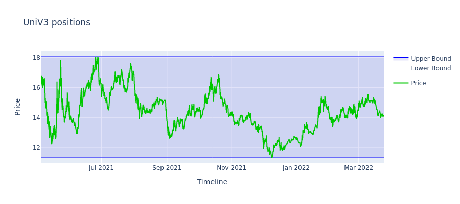
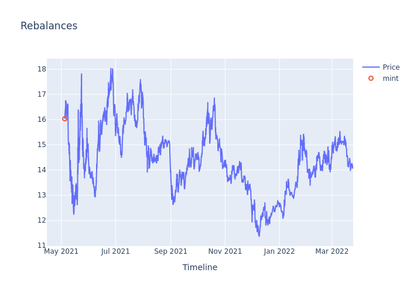
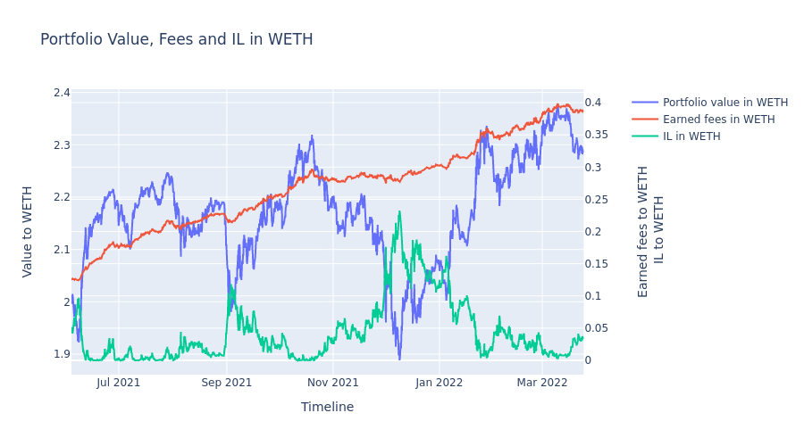
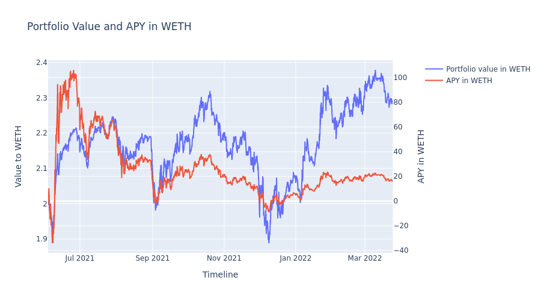
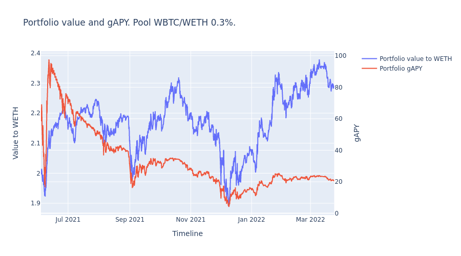

.. |br| raw:: html

   

Getting Started
==============================

Setup
~~~~~~~~~~~~

::
    
    python3 -m venv .venv
    source .venv/bin/activate
    pip install mellow_strategy_sdk

The easiest way to get started is to use SDK examples in the `Github repo <https://github.com/mellow-finance/mellow-strategy-sdk/tree/main/examples>`_.
|br|

Import
~~~~~~~~~~~~

::
    
    from mellow_sdk.primitives import Pool, POOLS
    from mellow_sdk.data import RawDataUniV3
    from mellow_sdk.strategies import AbstractStrategy
    from mellow_sdk.backtest import Backtest
    from mellow_sdk.viewers import RebalanceViewer, UniswapViewer, PortfolioViewer
    from mellow_sdk.positions import BiCurrencyPosition, UniV3Position

Choose a pool
~~~~~~~~~~~~~~~~

A typical notebook would start with downloading and preparing data for a specific pool.
|br| ``POOLS`` is a list of available pools, let's choose 1 it is WBTC/WETH, fee 0.3%

::

    pool_num = 1
    pool = Pool(
        tokenA=POOLS[pool_num]['token0'], 
        tokenB=POOLS[pool_num]['token1'], 
        fee=POOLS[pool_num]['fee']
    )

Get data
~~~~~~~~~~~~

Аt the first run you need to download the data
::

    data = RawDataUniV3(pool, 'data', reload_data=False).load_from_folder()

Create strategy
~~~~~~~~~~~~~~~~~~~~~~~~
::

    class UniV3Passive(AbstractStrategy):
        """
        ``UniV3Passive`` is the passive strategy on UniswapV3, i.e. mint one interval and wait.

        Attributes:
            lower_price: Lower bound of the interval
            upper_price: Upper bound of the interval
            gas_cost: Gas costs, expressed in currency
            pool: UniswapV3 Pool instance
            name: Unique name for the instance
        """
        def __init__(self,
                    lower_price: float,
                    upper_price: float,
                    pool: Pool,
                    gas_cost: float,
                    name: str = None,
                    ):
            super().__init__(name)
            self.lower_price = lower_price
            self.upper_price = upper_price

            self.fee_percent = pool.fee.percent
            self.gas_cost = gas_cost
            self.swap_fee = pool.fee.percent

        def rebalance(self, *args, **kwargs) -> str:
            # record is row of historic data
            record = kwargs['record']
            
            # portfolio managed by the strategy
            portfolio = kwargs['portfolio']
            price_before, price = record['price_before'], record['price']

            is_rebalanced = None

            if len(portfolio.positions) == 0:
                self.create_uni_position(portfolio=portfolio, price=price)
                is_rebalanced = 'mint'

            if 'UniV3Passive' in portfolio.positions:
                uni_pos = portfolio.get_position('UniV3Passive')
                
                # collect fees from uni
                uni_pos.charge_fees(price_before, price)

            return is_rebalanced

        def create_uni_position(self, portfolio, price):
            x = 1 / price
            y = 1
            
            # create biccurency positions for swap
            bi_cur = BiCurrencyPosition(
                name=f'main_vault',
                swap_fee=self.swap_fee,
                gas_cost=self.gas_cost,
                x=x,
                y=y,
                x_interest=None,
                y_interest=None
            )
            # create uni interval
            uni_pos = UniV3Position(
                name=f'UniV3Passive',
                lower_price=self.lower_price,
                upper_price=self.upper_price,
                fee_percent=self.fee_percent,
                gas_cost=self.gas_cost,
            )

            portfolio.append(bi_cur)
            portfolio.append(uni_pos)

            # get tokens amount to swap
            dx, dy = uni_pos.aligner.get_amounts_for_swap_to_optimal(
                x, y, swap_fee=bi_cur.swap_fee, price=price
            )
            
            # swap
            if dx > 0:
                bi_cur.swap_x_to_y(dx, price=price)
            if dy > 0:
                bi_cur.swap_y_to_x(dy, price=price)
            
            x_uni, y_uni = uni_pos.aligner.get_amounts_after_optimal_swap(
                x, y, swap_fee=bi_cur.swap_fee, price=price
            )
            
            # withdraw tokens from bicurrency
            bi_cur.withdraw(x_uni, y_uni)
            
            # deposit tokens to uni
            uni_pos.deposit(x_uni, y_uni, price=price)

Typycally the definition of the ``rebalance`` method would contain two sections:

- `Init`
            On the first call you need to initialize strategy's portfolio under management.
            Here you create initial positions at ``create_uni_position`` and ``append`` to ``Portfolio``

- `Rebalance`
            In this section you decide if you want to rebalance or not.
            If you rebalance you need to implement the logic of rebalance.

Backtest
~~~~~~~~~~~~

Next step is to run backtest using your strategy and data

::

    univ3_passive = UniV3Passive(
        lower_price=data.swaps['price'].min(),
        upper_price=data.swaps['price'].max(),
        pool=pool,
        gas_cost=0.,
        name='passive'
    )

    bt = Backtest(univ3_passive)
    portfolio_history, rebalance_history, uni_history = bt.backtest(data.swaps)

Visualize
~~~~~~~~~~~~

Next visualize results
::

    rv = RebalanceViewer(rebalance_history)
    uv = UniswapViewer(uni_history)
    pv = PortfolioViewer(portfolio_history, pool)

    # Draw portfolio stats, like value, fees earned, apy
    fig1, fig2, fig3, fig4, fig5, fig6 = pv.draw_portfolio()

    # Draw Uniswap intervals
    intervals_plot = uv.draw_intervals(data.swaps)

    # Draw rebalances
    rebalances_plot = rv.draw_rebalances(data.swaps)

    # Calculate df with portfolio stats
    stats = portfolio_history.calculate_stats()

::

    intervals_plot.show()

::

    rebalances_plot.show()

::

    fig2.show()

::

    fig4.show()

::

    fig6.show()

::

    stats.tail(2)

.. csv-table:: Table Title
   :file: ../../examples/getting_started_stats.csv
   :header-rows: 1

Congratulations! Now you have the results of your strategy backtest on the real UniV3 data!