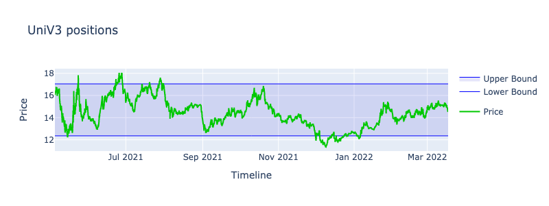
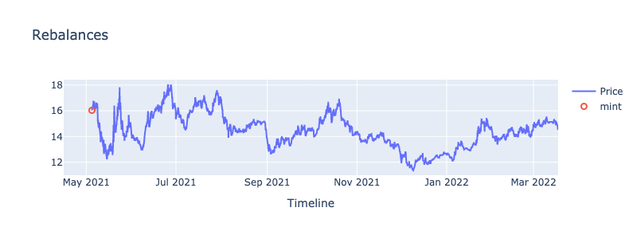
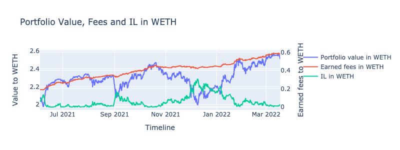
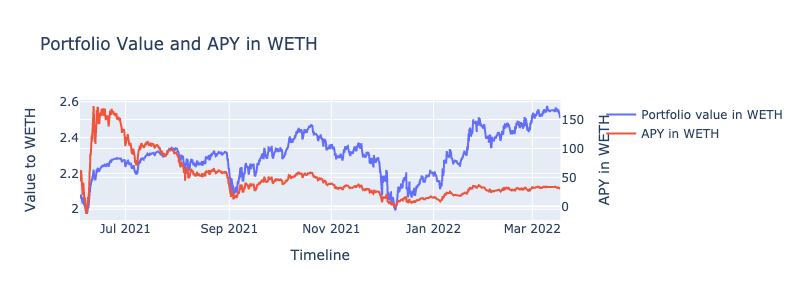
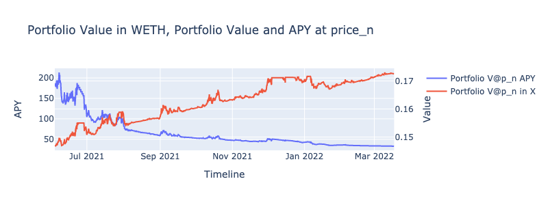

.. |br| raw:: html

   

Getting Started
==============================

Setup
~~~~~~~~~~~~
Follow the installation instructions from the ``README.md`` file

::

    git clone https://github.com/mellow-finance/mellow-strategy-sdk.git
    cd mellow-strategy-sdk
    python3 -m venv .venv
    source .venv/bin/activate
    pip install poetry==1.1.13
    poetry install

The easiest way to get started is to clone SDK and use examples in the `Github repo <https://github.com/mellow-finance/mellow-strategy-sdk/tree/main/examples>`_.
|br| The notebook with this code is also in the examples.

Choose a pool
~~~~~~~~~~~~

A typical notebook would start with downloading and preparing data for a specific pool.
|br| ``POOLS`` is a list of available pools, let's choose 1 it is WBTC/WETH, fee 0.3%

::

    from strategy.primitives import POOLS, Pool
    pool_num = 1
    my_pool = Pool(
        tokenA=POOLS[pool_num]['token0'], 
        tokenB=POOLS[pool_num]['token1'], 
        fee=POOLS[pool_num]['fee']
    )

Get data
~~~~~~~~~~~~

For each pool at the first run you need to download the data
::

    from strategy.data import DownloaderRawDataUniV3
    # downloads mint, burn, swap for the pool, this needs to be done once the files are added to ../data/
    # ~5min
    DownloaderRawDataUniV3().load_events(pool_num)

You also you can use ``strategy.data.SyntheticData`` or ``utilities.utilities.get_data_from_binance``

After loading the data, they can be read locally. Сreate an object with pool data.
::

    from strategy.data import RawDataUniV3
    data = RawDataUniV3(my_pool).load_from_folder()

Create strategy
~~~~~~~~~~~~~~~~~~~~~~~~
::

    from strategy.strategies import AbstractStrategy
    from strategy.uniswap_utils import UniswapLiquidityAligner
    from strategy.positions import UniV3Position

    class UniV3Passive(AbstractStrategy):
        """
        ``UniV3Passive`` is the passive strategy on UniswapV3 without rebalances.
            i.e. mint interval and wait.
            lower_price: Lower bound of the interval
            upper_price: Upper bound of the interval
            rebalance_cost: Rebalancing cost, expressed in currency
            pool: UniswapV3 Pool instance
            name: Unique name for the instance
        """
        def __init__(self,
                    lower_price: float,
                    upper_price: float,
                    pool: Pool,
                    rebalance_cost: float,
                    name: str = None,
                    ):
            super().__init__(name)
            self.lower_price = lower_price
            self.upper_price = upper_price
            self.decimal_diff = -pool.decimals_diff
            self.fee_percent = pool.fee.percent
            self.rebalance_cost = rebalance_cost

        def rebalance(self, *args, **kwargs) -> str:
            timestamp = kwargs['timestamp']
            row = kwargs['row']
            portfolio = kwargs['portfolio']
            price_before, price = row['price_before'], row['price']

            
            if len(portfolio.positions) == 0:
                univ3_pos = self.create_uni_position(price)
                portfolio.append(univ3_pos)
                return 'mint'
            
            uni_pos = portfolio.get_position('UniV3Passive')
            uni_pos.charge_fees(price_before, price)

        def create_uni_position(self, price):
            univ3_pos = UniV3Position('UniV3Passive', self.lower_price, self.upper_price, self.fee_percent, self.rebalance_cost)
            x_uni_aligned, y_uni_aligned = univ3_pos.swap_to_optimal(x=1 / price, y=1, price=price)
            univ3_pos.deposit(x=x_uni_aligned, y=y_uni_aligned, price=price)
            return univ3_pos

Typycally the definition of the ``rebalance`` method would contain two sections:

- `Init`
            On the first call you need to initialize strategy's portfolio under management.
            Here you need to create initial positions with ``append``
            method of :meth:`strategies.portfolio.Portfolio` and invest initial amount using ``deposit`` method.
- `Rebalance`
            In this section you decide if you want to rebalance or not.
            If you rebalance you need to implement the logic of rebalance.

Backtest
~~~~~~~~~~~~

Next step is to run backtest using your strategy and data::

    from strategy.backtest import Backtest

    univ3_passive = UniV3Passive(
        lower_price=data.swaps['price'].min(),
        upper_price=data.swaps['price'].max(),
        pool=pool,
        rebalance_cost=0.,
        name='passive'
    )
    b = Backtest(univ3_passive)
    portfolio_history, rebalance_history, uni_history = b.backtest(data.swaps)

Visualize
~~~~~~~~~~~~

Next visualize results
::

    from strategy.viewers import RebalanceViewer, UniswapViewer, PotrfolioViewer

    import plotly.offline as pyo
    import plotly.graph_objs as go

    rv = RebalanceViewer(rebalance_history)
    uv = UniswapViewer(uni_history)
    pv = PotrfolioViewer(portfolio_history, pool)

    # Draw portfolio stats, like value, fees earned, apy
    fig1, fig2, fig3, fig4, fig5, fig6 = pv.draw_portfolio()

    # Draw Uniswap intervals
    intervals_plot = uv.draw_intervals(data.swaps)

    # Draw rebalances
    rebalances_plot = rv.draw_rebalances(data.swaps)

    # Calculate df with portfolio stats
    stats = portfolio_history.calculate_stats()
    
::

    intervals_plot.update_layout(height=300, width=800).write_image("intervals_plot.png")

::

    rebalances_plot.update_layout(height=300, width=800).show()

::

    fig2.update_layout(height=300, width=800).show()

::

    fig4.update_layout(height=300, width=800).show()

::

    fig6.update_layout(height=300, width=800).show()

::

    stats.tail(3)

.. csv-table:: Table Title
   :file: ../../examples/stats.csv
   :header-rows: 1

Congratulations! Now you have the results of your strategy backtest on the real UniV3 data!